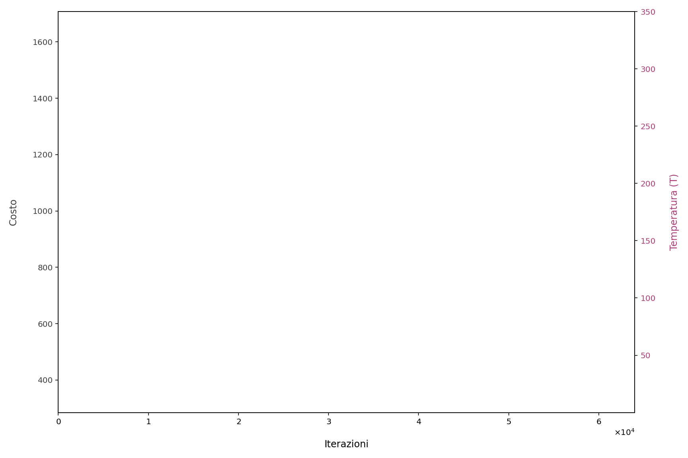
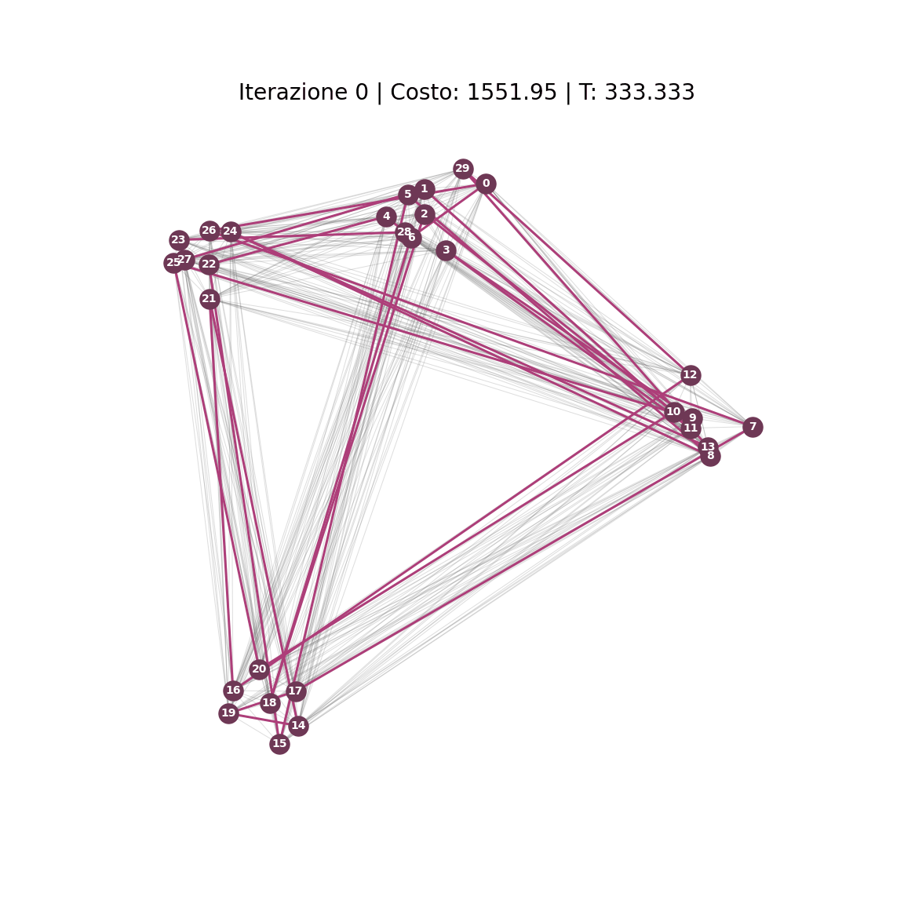
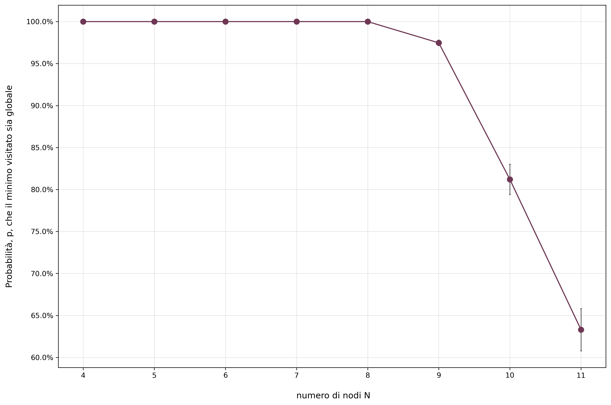
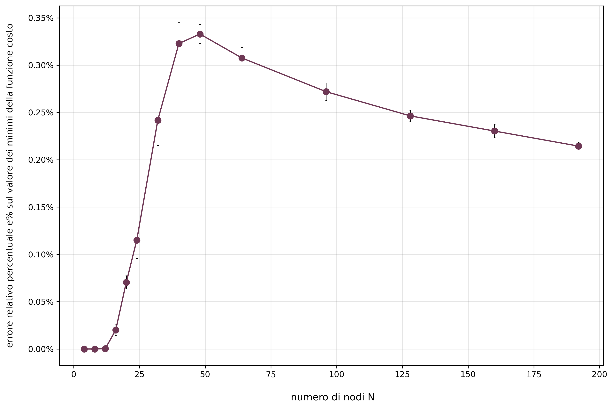
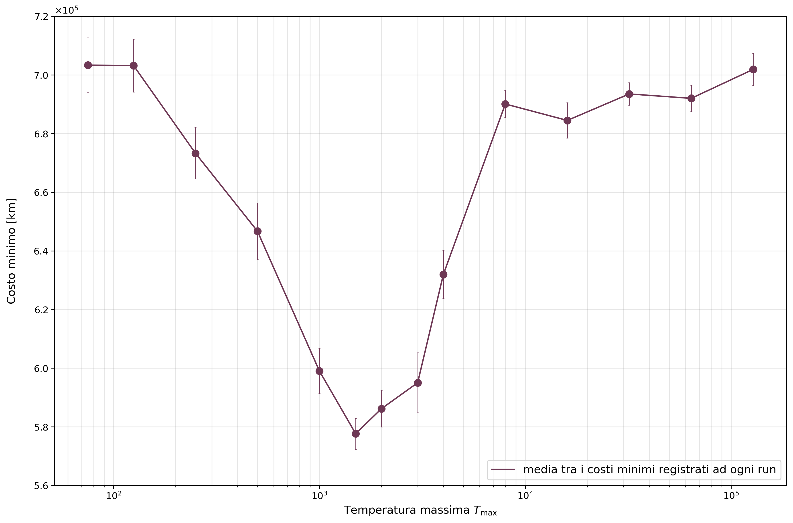

# optimization-traveling-salesman-problem
University project for the *Optimization and Statistical Mechanics* exam (Physics Master Degree, "Physics of Complex Systems and Big Data" curriculum).

## 🧠 How the Simulated Annealing Algorithm Works
The Simulated Annealing (S.A.) algorithm used in this project is structured in consecutive cycles of **Cooling** and **Heating** to find the optimal path. Here is the step-by-step evolution:

1. **Initial Setup:** I start with a random path (tour) visiting all $N$ nodes. I set an initial high temperature $T_{max}$ (which corresponds to a very low $\beta$, since $T \propto 1/\beta$). This allows the system to explore the solution space freely.

2. **State Perturbation:** At each step, I generate a new candidate tour $Y$ by slightly mutating the current tour $X$ (e.g., swapping the visit order of two random cities).

3. **Metropolis Criterion:** I calculate the cost difference $\Delta C = C(Y) - C(X)$. 
   * If $\Delta C < 0$, the new tour is better and is always accepted.
   * If $\Delta C > 0$, the new tour is worse, but it might still be accepted with a probability $p = e^{-\beta \Delta C}$.

4. **Cooling Phase:** I gradually increase $\beta$ (decreasing the temperature). As the system cools, the probability of accepting worse solutions drops exponentially. This forces the algorithm to settle into a local or global minimum (fine-tuning).

5. **Heating Phase (Reheating):** Once the minimum temperature $T_{min}$ is reached, the system is slowly heated back up (decreasing $\beta$). This gives the algorithm a burst of energy to "climb out" of any suboptimal local minima it might have fallen into.

6. **Annealing Cycles:** Steps 4 and 5 are repeated for a set number of `annealing_cycles`. The absolute best tour found across all cycles is then returned as the final solution.

*Below is the static and dynamic evolution of Cost and Temperature over the annealing cycles, alongside the physical routing optimization on a synthetic modular graph:*

## 📊 The Three Main Studies
The project is structured into three analytical phases using synthetic modular datasets and one application phase on real geographic data.

### 1. Convergence to the Ground State
For small numbers of nodes ($N < 12$), I verified that the method has a high probability of converging to the exact ground state (global minimum) rather than getting stuck in a metastable state. The probability is maximum (100%) for $N < 9$ and remains above 60% up to $N = 11$.

### 2. Method Stability
At a fixed $N$, the method is highly stable regardless of the initial distance matrix or the starting tour. The relative percentage error calculated on the minimum cost values remains extremely low, peaking at merely $\approx 0.35\%$.

### 3. Optimal Temperature Range ($T_{max}$)
To ensure optimal results without wasting computational resources, an adaptive search for the optimal initial maximum temperature ($T_{max}$) was studied. The plot below shows the minimum cost recorded across different initial temperatures for a worldwide dataset. The increasing trend at the right end of the plot is likely because, starting from such extremely high temperatures, the system would require a considerably longer cooling time to properly converge to the global minimum.

## 🌍 Real-World Application
Finally, the algorithm was tested on real geographic coordinates. Below is the routing optimization applied to 45 European capitals, visually demonstrating the algorithm dynamically minimizing the travel distance.

